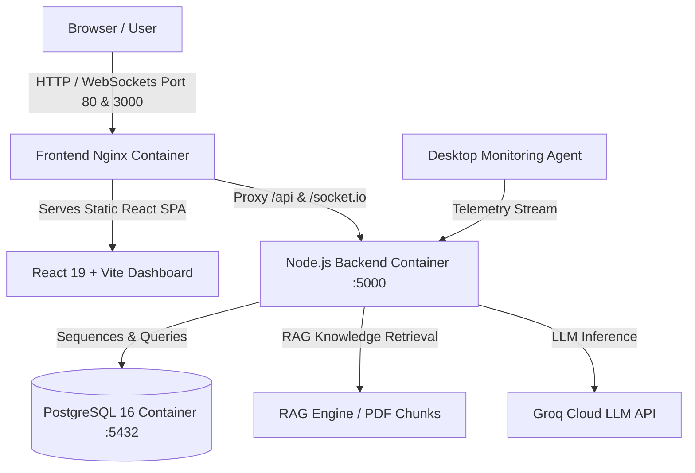
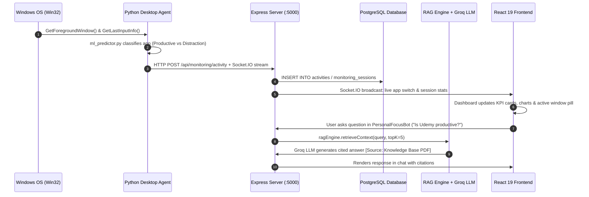

# 🛡️ FocusGuard AI — Human Attention Preservation & Digital Distraction Intelligence Platform

> **FocusGuard AI** is an intelligent, privacy-preserving attention analytics and distraction mitigation platform. It combines active window telemetry, machine learning distraction detection, Pomodoro & deep-focus workflows, PostgreSQL persistence, and an integrated RAG-powered Personal Focus Assistant.

---

## 📑 Table of Contents
1. [Which File Do I Open First? (Quick Navigation)](#-which-file-do-i-open-first-quick-navigation)
2. [End-to-End System Architecture](#-end-to-end-system-architecture)
3. [Repository Structure Blueprint](#-repository-structure-blueprint)
4. [Frontend Architecture & Component Guide](#-frontend-architecture--component-guide)
5. [Backend Architecture & API Map](#-backend-architecture--api-map)
6. [Desktop Monitoring Agent & ML Engine](#-desktop-monitoring-agent--ml-engine)
7. [RAG AI Copilot (Groq + PDF Knowledge Base)](#-rag-ai-copilot-groq--pdf-knowledge-base)
8. [Demonstration & Code Presentation Script](#-demonstration--code-presentation-script)
9. [Docker & Local Setup Guide](#-docker--local-setup-guide)
10. [Frequently Asked Questions & Answers](#-frequently-asked-questions--answers)

---

## 🎯 Which File Do I Open First? (Quick Navigation)

If you are opening this project and want to quickly inspect or edit a specific feature, use this cheat sheet:

| Goal / Feature to Inspect | File to Open | Description |
| :--- | :--- | :--- |
| **All Frontend URLs & Routes** | [frontend/src/App.jsx](file:///d:/INFOSYS/FocusGuard-AI--Human-Attention-Preservation---Digital-Distraction-Intelligence-Platform-July-2026/frontend/src/App.jsx) | React Router declaring `/landing`, `/login`, `/register`, `/dashboard` |
| **Frontend Entry Point** | [frontend/src/main.jsx](file:///d:/INFOSYS/FocusGuard-AI--Human-Attention-Preservation---Digital-Distraction-Intelligence-Platform-July-2026/frontend/src/main.jsx) | Vite bootstrap mounting React DOM root |
| **Main Dashboard (Tabs, Timer, Header)** | [frontend/src/pages/Dashboard.jsx](file:///d:/INFOSYS/FocusGuard-AI--Human-Attention-Preservation---Digital-Distraction-Intelligence-Platform-July-2026/frontend/src/pages/Dashboard.jsx) | Central hub managing activeTab, activeSession, and notifications |
| **Component Directory (All 25 Components)** | [frontend/src/components/index.js](file:///d:/INFOSYS/FocusGuard-AI--Human-Attention-Preservation---Digital-Distraction-Intelligence-Platform-July-2026/frontend/src/components/index.js) | Categorized registry dividing components into Tabs, UI, and AI |
| **Backend Entry Point** | [backend/server.js](file:///d:/INFOSYS/FocusGuard-AI--Human-Attention-Preservation---Digital-Distraction-Intelligence-Platform-July-2026/backend/server.js) | Express app, Socket.IO real-time server, route middleware |
| **Database Pool & Tables** | [backend/config/db.js](file:///d:/INFOSYS/FocusGuard-AI--Human-Attention-Preservation---Digital-Distraction-Intelligence-Platform-July-2026/backend/config/db.js) | PostgreSQL connection & auto-table initializers (`CREATE TABLE IF NOT EXISTS`) |
| **Scoring & Session Logic** | [backend/controllers/activityController.js](file:///d:/INFOSYS/FocusGuard-AI--Human-Attention-Preservation---Digital-Distraction-Intelligence-Platform-July-2026/backend/controllers/activityController.js) | Ingestion of telemetry, session scoring algorithm, AI assistant handler |
| **RAG Knowledge Search** | [backend/services/ragEngine.js](file:///d:/INFOSYS/FocusGuard-AI--Human-Attention-Preservation---Digital-Distraction-Intelligence-Platform-July-2026/backend/services/ragEngine.js) | Chunker and keyword/relevance retrieval on knowledge base PDF |
| **Desktop Activity Tracker** | [monitoring-agent/main.py](file:///d:/INFOSYS/FocusGuard-AI--Human-Attention-Preservation---Digital-Distraction-Intelligence-Platform-July-2026/monitoring-agent/main.py) | Python daemon polling active windows & idle intervals |
| **ML Model Training** | [ai/train_model.py](file:///d:/INFOSYS/FocusGuard-AI--Human-Attention-Preservation---Digital-Distraction-Intelligence-Platform-July-2026/ai/train_model.py) | Random Forest & Decision Tree classifier trainer |

---

## 🏛 End-to-End System Architecture



### Telemetry & RAG Flow


---

## 📁 Repository Structure Blueprint

```
FOCUSGUARD-AI-PROJECT/
├── 🌐 frontend/              # React 19 + Vite Frontend SPA
│   ├── src/
│   │   ├── main.jsx          # Vite React root mount
│   │   ├── App.jsx           # Master URL router (/, /login, /register, /dashboard)
│   │   ├── index.css         # Global design tokens, dark/light themes
│   │   ├── pages/            # Top-level route pages
│   │   │   ├── LandingPage.jsx   # Marketing & features homepage
│   │   │   ├── Login.jsx         # Sign-in page
│   │   │   ├── Register.jsx      # Sign-up page
│   │   │   ├── Dashboard.jsx     # Main product dashboard (hosts all tabs)
│   │   │   └── dashboard.css     # Styles for dashboard & view tabs
│   │   ├── components/       # UI components & tab views (cataloged in index.js)
│   │   │   ├── index.js          # Component registry & categorized exports
│   │   │   ├── Sidebar.jsx       # Left navigation menu
│   │   │   ├── DashboardOverview.jsx # Default dashboard tab
│   │   │   ├── ActivityView.jsx      # Active window activity tab
│   │   │   ├── FocusSessionsView.jsx # Pomodoro sessions tab
│   │   │   ├── DistractionsView.jsx  # Distraction logs tab
│   │   │   ├── RecentTelemetryView.jsx # Live telemetry stream tab
│   │   │   ├── GoalsView.jsx         # Daily/weekly goals tab
│   │   │   ├── ReportsView.jsx       # Analytics reports & PDF export tab
│   │   │   ├── AnalyticsView.jsx     # Deep focus curves tab
│   │   │   ├── AIInsightsView.jsx    # ML insights tab
│   │   │   ├── SettingsView.jsx      # App preferences & agent keys tab
│   │   │   └── PersonalFocusBot.jsx  # Floating RAG-powered AI chat assistant
│   │   └── services/
│   │       └── api.js        # Axios / fetch base configuration
│   └── README.md             # Frontend Roadmap & Guide
│
├── ⚙️ backend/               # Node.js + Express + Socket.IO REST API
│   ├── server.js             # Main server setup & socket handler
│   ├── config/
│   │   └── db.js             # PostgreSQL connection & auto schema creation
│   ├── routes/               # Express route definitions
│   │   ├── authRoutes.js     # User registration & login endpoints
│   │   ├── activityRoutes.js # Telemetry ingestion, sessions, AI chat
│   │   ├── goalRoutes.js     # Focus goal tracking
│   │   └── userRoutes.js     # User profile management
│   ├── controllers/          # Request handlers & DB operations
│   │   ├── authController.js
│   │   ├── activityController.js
│   │   ├── goalController.js
│   │   └── userController.js
│   ├── middleware/
│   │   └── authMiddleware.js # JWT authentication guard
│   ├── services/
│   │   └── ragEngine.js      # Vector knowledge base & Groq LLM integration
│   └── README.md             # Backend Roadmap & Guide
│
├── 💻 monitoring-agent/      # Native Python Desktop Activity Daemon
│   ├── main.py               # Background daemon entry point
│   ├── activity_monitor.py   # Windows foreground window poll loop
│   ├── idle_detector.py      # Keyboard/mouse inactivity detector
│   └── ml_predictor.py       # Local distraction inference engine
│
├── 🧠 ai/                    # ML Model Training & Evaluation
│   ├── train_model.py        # Random Forest / Decision Tree model trainer
│   ├── models/               # Saved joblib model files
│   └── reports/              # Model classification metrics & reports
│
└── 🗄️ database/              # SQL schemas & migration scripts
    └── schema.sql            # Master database DDL
```

---

## 🌐 Frontend Architecture & Component Guide

### 1. Routes (`src/App.jsx`)
- `/` or `/landing` ➔ [LandingPage.jsx](file:///d:/INFOSYS/FocusGuard-AI--Human-Attention-Preservation---Digital-Distraction-Intelligence-Platform-July-2026/frontend/src/pages/LandingPage.jsx): Product marketing, dynamic counters, ambient animations.
- `/login` ➔ [Login.jsx](file:///d:/INFOSYS/FocusGuard-AI--Human-Attention-Preservation---Digital-Distraction-Intelligence-Platform-July-2026/frontend/src/pages/Login.jsx): JWT authentication and browser credential storage.
- `/register` ➔ [Register.jsx](file:///d:/INFOSYS/FocusGuard-AI--Human-Attention-Preservation---Digital-Distraction-Intelligence-Platform-July-2026/frontend/src/pages/Register.jsx): Account creation.
- `/dashboard` ➔ [Dashboard.jsx](file:///d:/INFOSYS/FocusGuard-AI--Human-Attention-Preservation---Digital-Distraction-Intelligence-Platform-July-2026/frontend/src/pages/Dashboard.jsx): Main authenticated application container.

### 2. Dashboard Tabs (`src/components/`)
Inside [Dashboard.jsx](file:///d:/INFOSYS/FocusGuard-AI--Human-Attention-Preservation---Digital-Distraction-Intelligence-Platform-July-2026/frontend/src/pages/Dashboard.jsx), the left **Sidebar** switches the active tab view:

| Tab Name | Component | Purpose |
| :--- | :--- | :--- |
| **Overview** | [DashboardOverview.jsx](file:///d:/INFOSYS/FocusGuard-AI--Human-Attention-Preservation---Digital-Distraction-Intelligence-Platform-July-2026/frontend/src/components/DashboardOverview.jsx) | High-level metrics, focus score gauge, quick start session |
| **Activity** | [ActivityView.jsx](file:///d:/INFOSYS/FocusGuard-AI--Human-Attention-Preservation---Digital-Distraction-Intelligence-Platform-July-2026/frontend/src/components/ActivityView.jsx) | Chronological active application log with productivity tags |
| **Focus Sessions** | [FocusSessionsView.jsx](file:///d:/INFOSYS/FocusGuard-AI--Human-Attention-Preservation---Digital-Distraction-Intelligence-Platform-July-2026/frontend/src/components/FocusSessionsView.jsx) | Pomodoro timer (25m/5m) and completed session log |
| **Distractions** | [DistractionsView.jsx](file:///d:/INFOSYS/FocusGuard-AI--Human-Attention-Preservation---Digital-Distraction-Intelligence-Platform-July-2026/frontend/src/components/DistractionsView.jsx) | Flagged non-productive apps and penalty point deductions |
| **Live Telemetry** | [RecentTelemetryView.jsx](file:///d:/INFOSYS/FocusGuard-AI--Human-Attention-Preservation---Digital-Distraction-Intelligence-Platform-July-2026/frontend/src/components/RecentTelemetryView.jsx) | Raw incoming JSON stream from the desktop Python agent |
| **Goals & Streaks**| [GoalsView.jsx](file:///d:/INFOSYS/FocusGuard-AI--Human-Attention-Preservation---Digital-Distraction-Intelligence-Platform-July-2026/frontend/src/components/GoalsView.jsx) | Daily and weekly focus targets, streak counters |
| **Reports** | [ReportsView.jsx](file:///d:/INFOSYS/FocusGuard-AI--Human-Attention-Preservation---Digital-Distraction-Intelligence-Platform-July-2026/frontend/src/components/ReportsView.jsx) | Productivity report generation, executive summary, PDF export |
| **Analytics** | [AnalyticsView.jsx](file:///d:/INFOSYS/FocusGuard-AI--Human-Attention-Preservation---Digital-Distraction-Intelligence-Platform-July-2026/frontend/src/components/AnalyticsView.jsx) | Historical focus curves, peak productive hours heatmap |
| **AI Insights** | [AIInsightsView.jsx](file:///d:/INFOSYS/FocusGuard-AI--Human-Attention-Preservation---Digital-Distraction-Intelligence-Platform-July-2026/frontend/src/components/AIInsightsView.jsx) | ML model accuracy, precision, and fatigue warnings |
| **Settings** | [SettingsView.jsx](file:///d:/INFOSYS/FocusGuard-AI--Human-Attention-Preservation---Digital-Distraction-Intelligence-Platform-July-2026/frontend/src/components/SettingsView.jsx) | Personal thresholds, theme toggle, and agent API keys |
| **AI Chatbot** | [PersonalFocusBot.jsx](file:///d:/INFOSYS/FocusGuard-AI--Human-Attention-Preservation---Digital-Distraction-Intelligence-Platform-July-2026/frontend/src/components/PersonalFocusBot.jsx) | Floating RAG Copilot grounded in the knowledge base PDF |

---

## ⚙️ Backend Architecture & API Map

| HTTP Route | Controller File | Function | Description |
| :--- | :--- | :--- | :--- |
| `POST /api/auth/register` | `authController.js` | `register` | Salted bcrypt password hashing & account creation |
| `POST /api/auth/login` | `authController.js` | `login` | Validates credentials & returns signed 7-day JWT |
| `GET /api/monitoring/status` | `activityController.js` | `getStatus` | Returns active session and live agent state |
| `POST /api/monitoring/session/start` | `activityController.js` | `startSession` | Starts tracked focus session in PostgreSQL |
| `POST /api/monitoring/session/stop` | `activityController.js` | `stopSession` | Finalizes session, computes final score & penalties |
| `POST /api/monitoring/activity` | `activityController.js` | `logActivity` | Ingests telemetry packet from desktop agent |
| `POST /api/ai/chat` | `activityController.js` | `chatWithAssistant` | Executes RAG semantic retrieval & queries Groq LLM |
| `GET /api/goals` | `goalController.js` | `getGoals` | Lists daily & weekly focus goals and streak counter |

---

## 💻 Desktop Monitoring Agent & ML Engine

Located in `monitoring-agent/`:
- **`windows_tracker.py`**: Interacts with the Windows Win32 API (`win32gui.GetForegroundWindow()`, `win32gui.GetWindowText()`, and `win32process.GetWindowThreadProcessId()`) to identify the foreground active window.
- **`idle_detector.py`**: Queries `win32api.GetLastInputInfo()`. If keyboard/mouse inactivity exceeds 60 seconds, pauses productive focus counting to prevent falsified statistics.
- **`ml_predictor.py`**: Executes inference using pre-trained models (`RandomForestClassifier` & `DecisionTreeClassifier`) trained on 1,057 real telemetry records in `ai/train_model.py`.

---

## 🧠 RAG AI Copilot (Groq + PDF Knowledge Base)

Located in `backend/services/ragEngine.js`:
- **Knowledge Ingestion**: Parses `FocusGuard_RAG_Knowledge_Base.pdf` (1,057 activity records, category statistics, and domain maps).
- **Chunking Strategy**: Categorizes into semantic chunks:
  - *Chunk 1: Rules & Productivity Guidelines* (Productive: Coding, Learning, Research, Office | Non-Productive: Social Media, Entertainment).
  - *Chunk 2: Category Breakdown Table* (Coding: 264, Social Media: 177, Office: 176, Research: 175, Communication: 89, Entertainment: 88).
  - *Chunk 3: Domain Summary Table* (`github.com`, `stackoverflow.com`, `udemy.com`, `facebook.com`, etc.).
  - *Chunk 4: Granular Paragraph Blocks*.
- **Scoring & Retrieval**: Tokenizes user questions, computes keyword & exact-match substring relevance, and pulls the top 5 chunks into the prompt.
- **LLM Synthesis**: Calls Groq API (`llama-3.3-70b-versatile` with automatic fallbacks) to output cited answers with `[Source: Knowledge Base PDF]`.

---

## 🎬 Demonstration & Code Presentation Script

Use this sequence when presenting FocusGuard AI:

1. **Step 1: Introduction (60 Seconds)**:
   - *"FocusGuard AI preserves attention by monitoring active window transitions via a native agent, detecting distraction using ML, and providing RAG-grounded coaching."*
2. **Step 2: Landing Page & Authentication**:
   - Open `http://localhost:5173`. Show the glassmorphic dark theme.
   - Click **Sign In**, log in, and point out the JWT authentication flow.
3. **Step 3: Dashboard Overview & Focus Score**:
   - Show the KPI cards: Attention Score, Deep Work Ratio, Context Switches, and Streaks.
   - Click **Start Focus Session** — demonstrate the live elapsed timer ticking in real-time.
4. **Step 4: Live RAG Chatbot Demonstration**:
   - Click the floating **Personal Focus Bot** on the bottom-right.
   - Ask: `Is Udemy considered productive or non-productive in the dataset?`
   - Show how the bot answers: It cites **Productive (88 records) under Learning [Source: Knowledge Base PDF]**.
   - Ask: `How many records exist for Coding?` ➔ Cites **264 records**.
5. **Step 5: Analytics, Goals & PDF Reports**:
   - Click through **Activity**, **Analytics**, and **Reports** to showcase the attention curves and PDF export.

---

## 🐳 Docker & Local Setup Guide

### 1. Docker Production Setup (Recommended)
```bash
# 1. Copy environment variables
cp .env.example .env

# 2. Build and launch all services
docker compose up --build -d

# 3. Verify health
docker compose ps
```

### 2. Local Development (Without Docker)
```bash
# 1. Backend Server
cd backend
npm install
npm run dev     # Runs on http://localhost:5000

# 2. Frontend Server
cd frontend
npm install
npm run dev     # Runs on http://localhost:5173

# 3. Desktop Monitoring Agent (Client Machine)
cd monitoring-agent
pip install -r requirements.txt
python main.py
```

### 3. Service Ports & URLs
| Service | URL | Description |
| :--- | :--- | :--- |
| **Frontend Web App** | [http://localhost:5173](http://localhost:5173) or [http://localhost:3000](http://localhost:3000) | React 19 Dashboard UI |
| **Backend REST API** | [http://localhost:5000/api](http://localhost:5000/api) | Express API endpoints |
| **API Health Check** | [http://localhost:5000/api/health](http://localhost:5000/api/health) | Live PostgreSQL & service status |
| **PostgreSQL DB** | `localhost:5432` | Relational activity database |

---

## ❓ Frequently Asked Questions & Answers

### Q1: How is the Focus Score calculated?
$$\text{Focus Score} = \left(\frac{\text{Productive Time}}{\text{Total Monitored Time}}\right) \times 100 - (\text{Context Switches} \times \text{Penalty})$$
> *The score starts at 100 and measures the ratio of productive time to total elapsed time. Rapid context switches between apps within a 60-second window deduct penalty points, encouraging sustained deep work.*

### Q2: Does the desktop agent violate user privacy?
> *No. FocusGuard AI never captures screenshots, keystrokes, webcam video, or clipboard data. It strictly reads OS window headers and process names (e.g., `Code.exe`), ensuring 100% privacy preservation.*

### Q3: Why use RAG instead of standard ChatGPT?
> *Standard LLMs hallucinate and have no knowledge of our specific 1,057-record dataset or organizational rules. The RAG engine retrieves exact passages from `FocusGuard_RAG_Knowledge_Base.pdf` before generating responses, providing 100% cited, verifiable answers.*

---

## 🔒 Security Best Practices
- Passwords are encrypted using salted `bcrypt` hashes (10 rounds).
- API authentication uses signed `JSON Web Tokens (JWT)` with 7-day expiration.
- Database access is isolated via Docker private bridge network (`focusguard_network`).
- Sensitive secrets (`GROQ_API_KEY`, `POSTGRES_PASSWORD`) are loaded strictly from `.env`.
