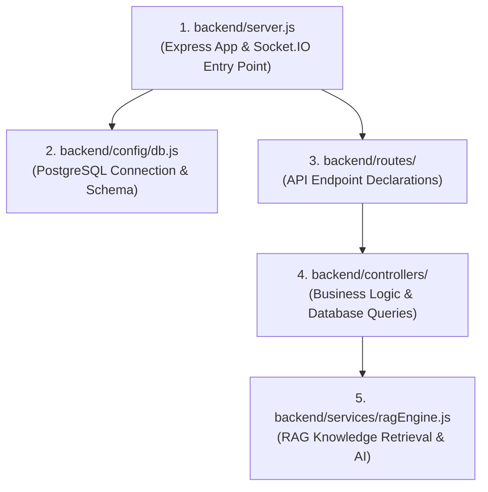

# 🛠️ Backend Structure & Architecture Guide

Welcome to the **FocusGuard AI Backend**! This guide explains how the backend is structured, which file to look at first, and how requests flow through the server.

---

## 🎯 Which File Do I Open First?

Start here:


1. **[backend/server.js](file:///d:/INFOSYS/FocusGuard-AI--Human-Attention-Preservation---Digital-Distraction-Intelligence-Platform-July-2026/backend/server.js)**: **The primary entry point**.
   - Boots up Express on port `5000`.
   - Initializes Socket.IO for real-time telemetry streaming.
   - Registers all route middleware under `/api/`.
   - Connects to PostgreSQL via `config/db.js`.

---

## 🗂️ Backend Directory Structure

```
backend/
├── server.js               # 🚀 Main server file (Express + Socket.IO + Middleware)
├── config/
│   └── db.js               # 🗄️ PostgreSQL pool connection & table schema initialization
├── routes/                 # 🛣️ URL endpoints routing
│   ├── authRoutes.js       # /api/auth/register, /api/auth/login
│   ├── activityRoutes.js   # /api/monitoring/activity, /api/monitoring/status, /api/ai/chat
│   ├── goalRoutes.js       # /api/goals, /api/goals/streak
│   └── userRoutes.js       # /api/users/profile
├── controllers/            # ⚙️ Business logic functions
│   ├── authController.js   # Password hashing (bcrypt) & JWT issuance
│   ├── activityController.js # Real-time window ingestion, focus scoring, AI recommendations
│   ├── goalController.js   # Goal tracking & streak computation
│   └── userController.js   # User profiles & preferences
├── middleware/             # 🛡️ Security & Token verification
│   └── authMiddleware.js   # Protects routes by validating JWT in Bearer header
├── services/               # 🧠 External services
│   └── ragEngine.js        # RAG pipeline for FocusGuard knowledge base + Groq LLM
├── monitor/                # 💻 Native Windows foreground window detection scripts
└── seed_dashboard_data.js  # 🌱 Test data seeder for local demo development
```

---

## 🛣️ API Routes & Controller Mapping

| HTTP Endpoint | Route File | Controller Function | Purpose |
| :--- | :--- | :--- | :--- |
| `POST /api/auth/register` | [authRoutes.js](file:///d:/INFOSYS/FocusGuard-AI--Human-Attention-Preservation---Digital-Distraction-Intelligence-Platform-July-2026/backend/routes/authRoutes.js) | `authController.register` | Registers new user account |
| `POST /api/auth/login` | [authRoutes.js](file:///d:/INFOSYS/FocusGuard-AI--Human-Attention-Preservation---Digital-Distraction-Intelligence-Platform-July-2026/backend/routes/authRoutes.js) | `authController.login` | Authenticates user & returns JWT |
| `GET /api/monitoring/status` | [activityRoutes.js](file:///d:/INFOSYS/FocusGuard-AI--Human-Attention-Preservation---Digital-Distraction-Intelligence-Platform-July-2026/backend/routes/activityRoutes.js) | `activityController.getStatus` | Gets active session & agent state |
| `POST /api/monitoring/activity`| [activityRoutes.js](file:///d:/INFOSYS/FocusGuard-AI--Human-Attention-Preservation---Digital-Distraction-Intelligence-Platform-July-2026/backend/routes/activityRoutes.js) | `activityController.logActivity` | Ingests telemetry from desktop agent |
| `POST /api/monitoring/session/start`| [activityRoutes.js](file:///d:/INFOSYS/FocusGuard-AI--Human-Attention-Preservation---Digital-Distraction-Intelligence-Platform-July-2026/backend/routes/activityRoutes.js) | `activityController.startSession` | Starts a tracked focus session |
| `POST /api/ai/chat` | [activityRoutes.js](file:///d:/INFOSYS/FocusGuard-AI--Human-Attention-Preservation---Digital-Distraction-Intelligence-Platform-July-2026/backend/routes/activityRoutes.js) | `activityController.chatWithBot` | Answers questions via RAG + Groq AI |
| `GET /api/goals` | [goalRoutes.js](file:///d:/INFOSYS/FocusGuard-AI--Human-Attention-Preservation---Digital-Distraction-Intelligence-Platform-July-2026/backend/routes/goalRoutes.js) | `goalController.getGoals` | Lists daily & weekly focus goals |

---

## ⚡ How It Connects to the Frontend

The React frontend sends requests to `/api/*` using the client configured in `frontend/src/services/api.js`.
- In local development, the frontend proxy or base URL targets `http://localhost:5000`.
- In Docker / production, Nginx reverse-proxies all `/api/` calls directly to the backend container.
